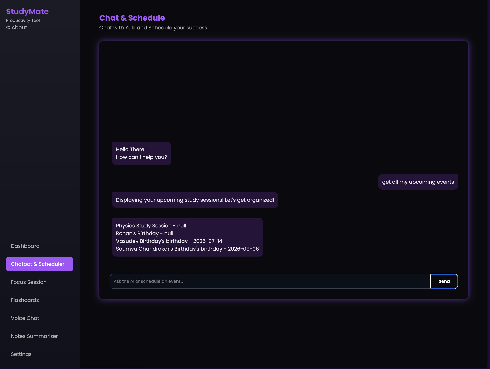
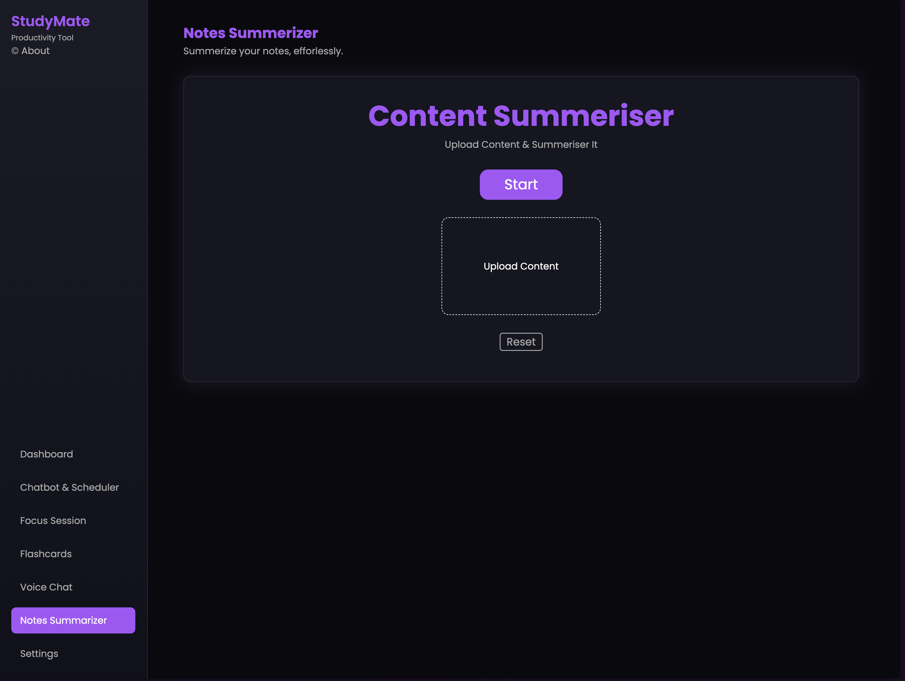
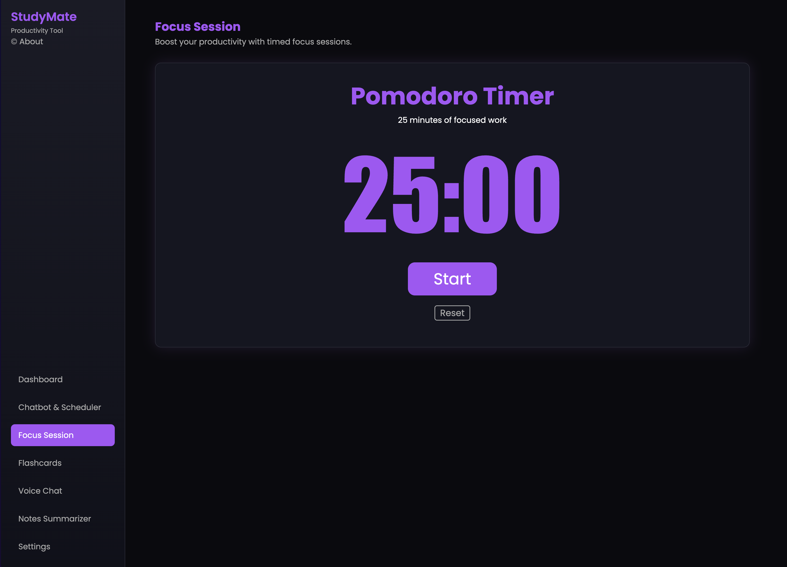
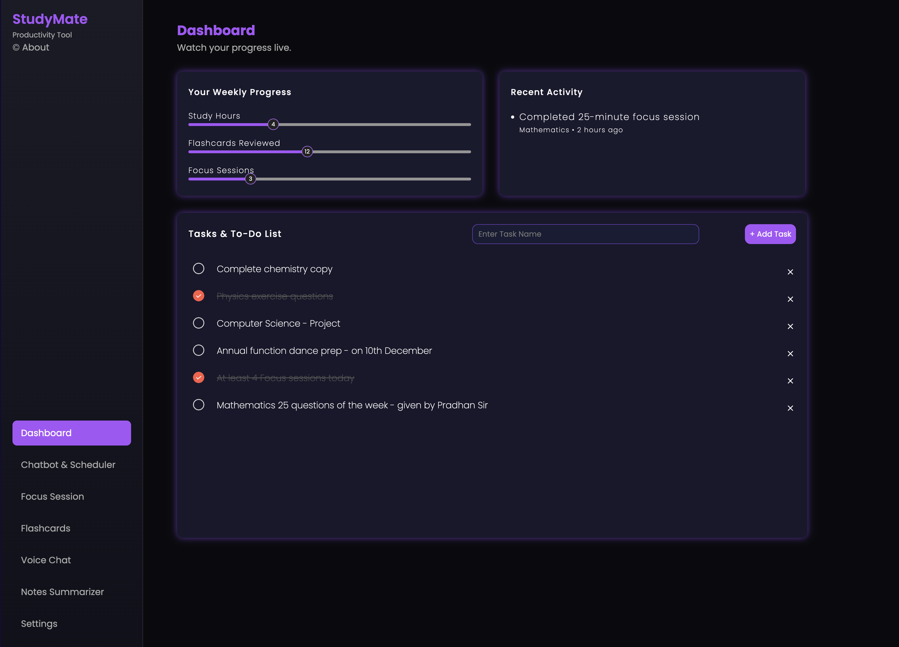

# Study Buddy 🧠

**Status:** 🚧 In Development  
Study Buddy is a smart digital companion designed to help students organize, track, and improve their study routines.  
The project is currently under development — backend is being built, while frontend integration is planned.  

---
# Watch live demos and screenshots
## *1. Chat-to-Calendar Scheduler*
You can chat Yuki, while it manages your study schedules.
<div>

<video src="assets/chatDemo.mp4" width="580" controls>
</div>

## *2. Voice Command Input*
Just dictate Yuki.
<div>

<video src="assets/voiceChat.mp4" width="580" controls>
</div>

## *3. Smart Notes Summeriser*
Summerise your notes or any study material in seconds.
<div>

<video src="assets/sumDemo.mp4" width="580" controls>
</div>

## *4. Focus Session*
25 minutes of focus and 5 minutes of break is all you need to be productive.
<div>

</div>

## *5. Dashboard*
All your weekly progress to satisfy your productivity.
<div>

</div>


---

## Planned Features

### 1. **Chat-to-Calendar Scheduler** ✅
- Chatbot converts natural language → calendar events.  
- Visual calendar view (Google Calendar style).  

### 2. **Flashcards Maker** ✅
- Auto-generate flashcards from notes or textbooks.  
- *“Test Me Mode”* → random flashcards for quick practice.  

### 3. **Task/Assignment Manager** ✅
- Example: “Remind me to finish my Physics homework by Friday.”  
- Stores tasks with deadlines, checklist view in frontend.  

### 4. **Smart Notes Summarizer** ✅
- Upload notes (text/PDFs).  
- Backend (Hugging Face model) creates concise summaries.  

### 5. **Daily Study Analytics** ✅
- Track study hours per subject.  
- Weekly reports: *“You studied Physics 40%, Math 30%...”*  

### 6. **Exam Countdown with Study Plan** 📝
- AI splits subjects across days until exam.  
- Shows countdown timer and daily study goals.  

### 7. **Distraction Blocker Suggestions** 📝
- Chatbot suggests Pomodoro breaks or motivational nudges.  

### 8. **Group Study Mode (Future)** 📝
- Share flashcards or schedules with friends (export/import JSON).  

### 9. **Voice Command Input (Optional)** ✅
- Speak instead of type: *“Add Physics at 4pm tomorrow.”*  
- Uses Web Speech API (JS) for speech-to-text.  

---

## Activation
- Backend Side ->
Install [Ollama](https://ollama.com/)
```Bash
ollama pull mistral
ollama create yuki -f backend/models/Rookie.Modelfile
```
```Bash
pip install -f requirements.txt
cd backend
uvicorn API_server:app
```

- Frontend -> Directly Open 'dashboard.html'

---

---

## Current Phase
- Backend API development in progress  
- Database models drafted  
- Frontend development upcoming  

---

## Vision
- Study Buddy aims to reduce student stress by combining scheduling, accountability, and collaboration into one AI-powered platform.  
- AI can handles your scrambled input, traditional UI can give you desired output.